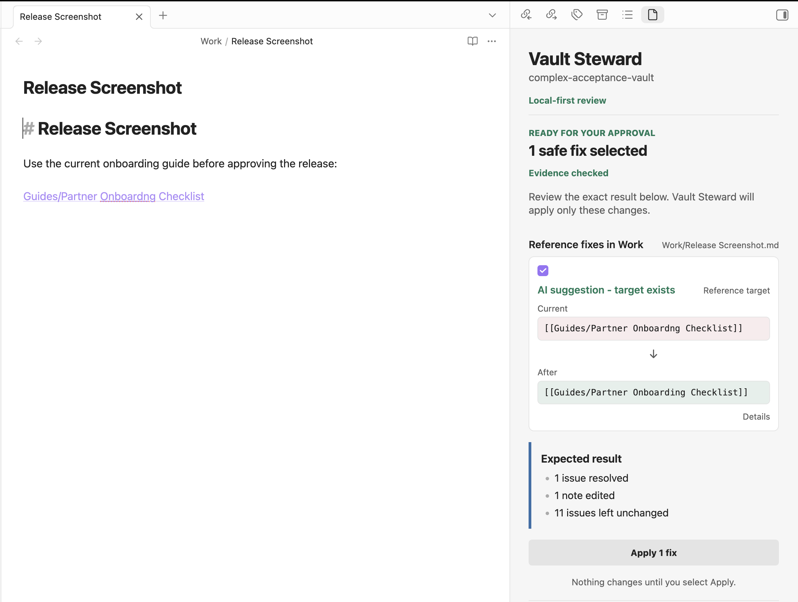

# Vault Steward

## Keep your vault trustworthy

Vault Steward helps you find broken references, schema problems, task and
decision drift, and policy violations in a local Obsidian vault. It presents
cited findings and safe repair options; it never edits a note on its own.

See the complete [scan-to-approval walkthrough](docs/screenshots.md).

## The simple flow

1. Choose a model provider in Settings.
2. Select **Check vault**.
3. Review the exact **Current** and **After** preview for each proposed change.
4. Select the changes you want, then explicitly use **Apply fixes**.

Each selected change is checked against the current note revision immediately
before it is applied. If the note changed, Vault Steward preserves that edit
and asks you to create a fresh preview.

## What Vault Steward checks

- Broken internal links, embeds, and anchors.
- Markdown and frontmatter schema violations.
- Task, decision, and deterministic YAML policy issues.
- Bounded, cited review candidates for duplicate entities, contradictions,
  staleness, and ambiguous decisions.

## Coordinated review, not autonomous editing

Deterministic checks parse the vault, validate evidence, prepare exact diffs,
and enforce policy. A configured model can classify or rank bounded cited
evidence, but it cannot write notes, change policy, approve a proposal, or
apply a fix. You remain the approval authority for every edit.

## Choose a model provider

Ollama is the local-first path. Ollama and llama.cpp-compatible providers must
use loopback-only endpoints. HyperFusion and OpenAI are experimental opt-in
cloud providers: each requires its own API key and acknowledgement before it
can receive bounded selected evidence at its fixed API origin. Acknowledging
one cloud provider does not enable the other.

Model quality varies by device, model, vault content, and task. See the
[local model guidance](docs/local-models.md) and
[evaluation methodology](EVALS.md) for detailed, local evaluation material.

## Privacy and safety

Vault Steward stores its canonical state locally and excludes note bodies,
prompts, raw model output, absolute paths, URLs, and secrets from default
traces. Cloud use is limited to the selected evidence and prompt required for
that request; it never grants authority to edit a note. Read the full
[privacy statement](PRIVACY.md) and [security overview](SECURITY.md).

## Install and get started

Obsidian desktop 1.13.0 or later is required. Build the plugin, copy the full
`dist/vault-steward/` directory to
`<vault>/.obsidian/plugins/vault-steward/`, enable it in Obsidian, configure a
provider, and start with **Check vault**. See
[release compatibility](docs/release-compatibility.md),
[troubleshooting](docs/troubleshooting.md), and
[upgrade notes](docs/upgrade-notes.md) for operating guidance.

## Limitations

macOS is the only validated desktop platform; Windows and Linux are
unvalidated. Vault Steward cannot establish external facts or guarantee model
accuracy, and its repair families are deliberately narrow. See
[known limitations](docs/known-limitations.md) for the complete boundaries.

## Documentation

- [Release readiness](docs/release-readiness.md)
- [Product walkthrough](docs/screenshots.md)
- [Changelog](CHANGELOG.md)
- [MIT license](LICENSE)
- [Troubleshooting](docs/troubleshooting.md)
- [Upgrade notes](docs/upgrade-notes.md)
- [Release compatibility](docs/release-compatibility.md)
- [Privacy](PRIVACY.md)
- [Security](SECURITY.md)
- [Known limitations](docs/known-limitations.md)
- [Observability and retained data](OBSERVABILITY.md)

## Development

Use Node.js 20 or later for development and packaging. Run the documented
checks in [CONTRIBUTING.md](CONTRIBUTING.md); release owners should follow the
[release-readiness guide](docs/release-readiness.md).
