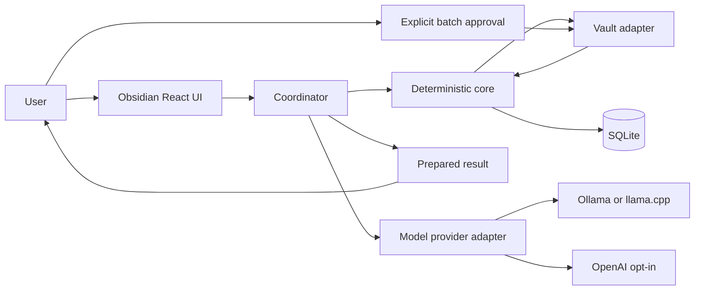
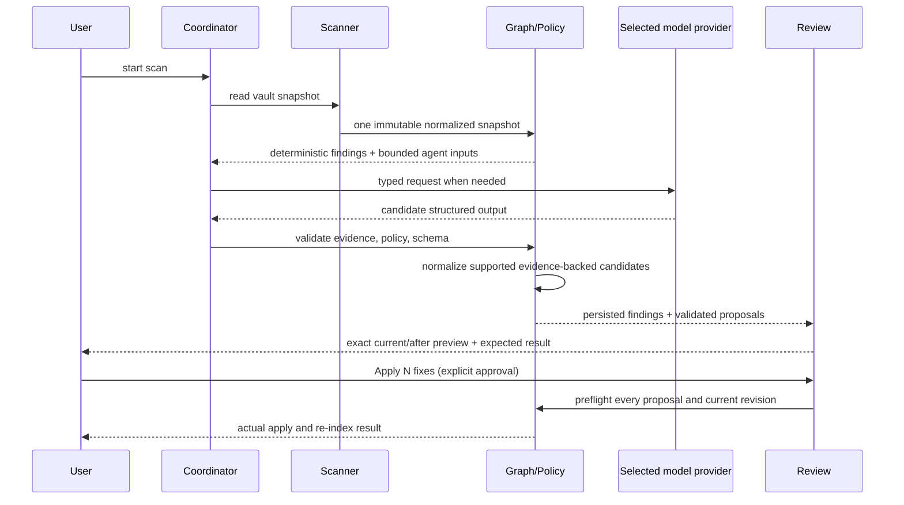

# System Architecture

## Authority

This document owns module boundaries, data ownership, trust boundaries, and workflow topology. Typed message and API shapes are authoritative in `docs/interfaces.md`.

## Deployment Model

Vault Steward is a TypeScript/React Obsidian plugin. It runs locally in the Obsidian desktop process and accesses the selected vault only through a narrow vault adapter. SQLite persists canonical indexed state. A configured model provider is required for a completed governed scan: loopback Ollama/llama.cpp by default, or the explicit fixed-origin OpenAI option after cloud-data acknowledgement.

## Components and Ownership

| Component        | Responsibility                                                | Owns                                  |
| ---------------- | ------------------------------------------------------------- | ------------------------------------- |
| `vault-adapter`  | Narrow read/write access through Obsidian APIs                | live vault interaction                |
| `scanner`        | Parse files and generate normalized scan records              | scan snapshot inputs                  |
| `reference`      | Resolve canonical notes/anchors and explicit cleanup contexts | bounded repair candidates             |
| `core`           | Derive checks and bounded model inputs from one scan          | governed scan result                  |
| `graph`          | Build deterministic note/entity/task/reference graph          | graph projection                      |
| `policy`         | Parse and evaluate YAML policies                              | policy results                        |
| `agents`         | Produce typed candidate findings from bounded inputs          | candidate outputs only                |
| `coordinator`    | Deduplicate, prioritize, persist findings                     | recommendation ordering               |
| `findings`       | Normalize bounded deterministic/model candidates              | authoritative typed finding boundary  |
| `review`         | Prepare exact result previews and recommended actions         | approval state                        |
| `apply`          | Validate and atomically apply approved patches                | audit trail and re-index trigger      |
| `storage`        | SQLite repositories and migrations                            | persisted product state               |
| `model-provider` | Bounded structured-generation calls                           | model request/response trace metadata |

## Main Workflow

## State and Failure Boundaries

`ready -> scanning -> recommendation -> applying -> result`. A scan creates an
immutable snapshot ID. Findings and proposals reference that ID and the
source-file revision. The recommendation state shows either a prepared repair
batch or one judgment action. `Apply N fixes` creates individual digest-bound
approval records, then preflights the entire selected batch before any write.
A stale or invalid member aborts the batch. Runtime failures retain grouped
writes, compensating rollback, recovery-required state, and re-indexing.
Failed parser/model/policy work produces one actionable error, never a silent
mutation.

## Reference Repair Boundary

Reference resolution is deterministic and scan-scoped. It checks an exact
vault-relative Markdown path first, then a unique basename, then a unique
frontmatter alias. Multiple matches are ambiguous and cannot produce an
automatic proposal. Parsed notes expose headings and valid block IDs; fenced
and indented code and malformed block identifiers are excluded from that
metadata.

For a missing anchor on an existing note, deterministic code ranks at most 20
headings and block IDs from that note. The selected model may return one
candidate ID or abstain. It never supplies target text, patch ranges, or write
authority. Deterministic rewriting preserves wiki/Markdown link and embed
syntax, visible labels, unaffected anchors, source-relative paths, and percent
encoding.

Reference normalization is context-triggered rather than a default cleanup
scan. Only a verified rename or explicitly confirmed canonical-note decision
can authorize normalization findings. Those findings still become
revision-bound proposals and pass the normal exact-preview, approval, all-member
preflight, rollback, and re-index path.

## Structured Task And Decision Repair Boundary

Task and decision repairs use the same immutable-snapshot and approved-proposal
path as references. Models may choose a permitted intent from snapshot-derived
candidate IDs, or supply a tightly constrained cited rationale; they cannot
construct Markdown ranges, values outside the candidate list, or a write.
Deterministic checks require a task's own `completed: true` or `status: done`
metadata before changing its checkbox. Due-date candidates are limited to the
task note, its resolved project, and directly linked decisions. Decision
association repairs appear only for an explicitly broken existing project or
related-decision value, and select an existing matching note.

Each task or decision proposal remains an ordinary revision-bound
`replace-range` operation. It can join compatible reference proposals in one
batch, but all members must pass digest, revision, expected-content, and
overlap preflight before the first write. The UI displays the exact field or
task fragment before and after the change, then reports the re-indexed result.

## Scale and Bottlenecks

The first release targets one desktop vault and batch scans. Expected bottlenecks are Markdown parsing, SQLite writes, and model inference. The adapter normalizes vault events into a bounded plan and conservatively falls back to a full governed scan for create, rename, delete, invalid, or overflowed batches. Within a running plugin process, immutable parsed notes are reused only when normalized path and revision are exact; SQLite stores eligibility metadata and dependency edges without retaining note bodies. A bounded in-memory coordinator cache reuses a model route only when its provider identity and declared route context are exact; changing one route's evidence invalidates that route without authorizing reuse of another. Model concurrency remains capped at one and per-agent context is bounded before considering background workers or a vector store.

Optional retrieval remains a derived local optimization. Evaluation can consume redacted ranked-candidate metadata to measure coverage, relevance, cache behavior, score distributions, and latency, but no retrieval result is an authority source for a finding, policy decision, proposal, approval, or edit.
