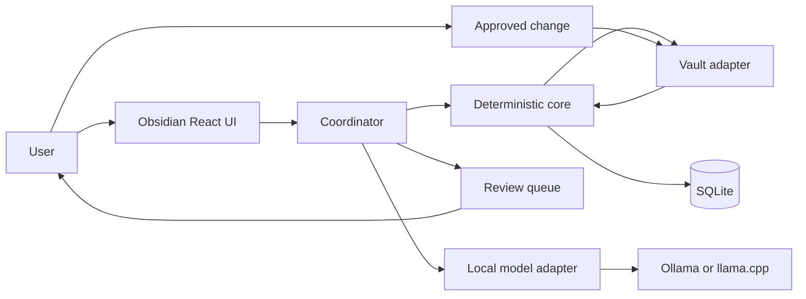
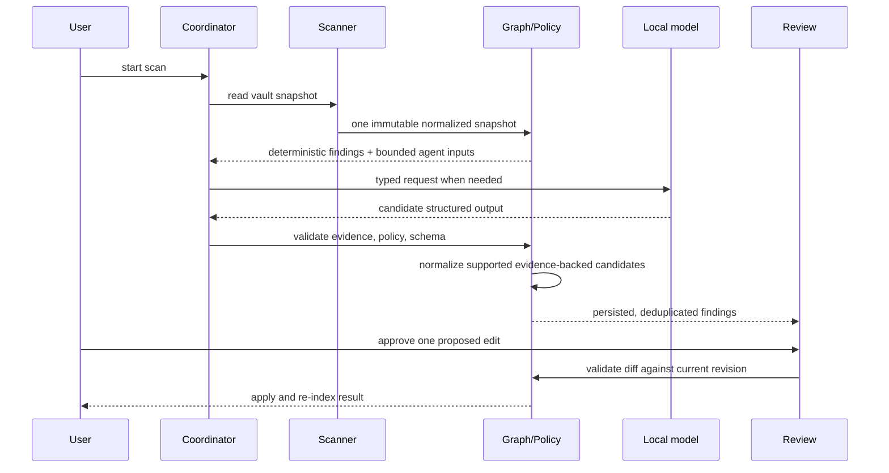

# System Architecture

## Authority

This document owns module boundaries, data ownership, trust boundaries, and workflow topology. Typed message and API shapes are authoritative in `docs/interfaces.md`.

## Deployment Model

Vault Steward is a TypeScript/React Obsidian plugin. It runs locally in the Obsidian desktop process and accesses the selected vault only through a narrow vault adapter. SQLite persists canonical indexed state. A configured local model provider (Ollama or llama.cpp) is required for a completed governed scan.

## Components and Ownership

| Component        | Responsibility                                       | Owns                                  |
| ---------------- | ---------------------------------------------------- | ------------------------------------- |
| `vault-adapter`  | Narrow read/write access through Obsidian APIs       | live vault interaction                |
| `scanner`        | Parse files and generate normalized scan records     | scan snapshot inputs                  |
| `core`           | Derive checks and bounded model inputs from one scan | governed scan result                  |
| `graph`          | Build deterministic note/entity/task/reference graph | graph projection                      |
| `policy`         | Parse and evaluate YAML policies                     | policy results                        |
| `agents`         | Produce typed candidate findings from bounded inputs | candidate outputs only                |
| `coordinator`    | Deduplicate, prioritize, persist findings            | review queue ordering                 |
| `findings`       | Normalize bounded deterministic/model candidates     | authoritative typed finding boundary  |
| `review`         | Render evidence and preview edits                    | approval state                        |
| `apply`          | Validate and atomically apply approved patches       | audit trail and re-index trigger      |
| `storage`        | SQLite repositories and migrations                   | persisted product state               |
| `model-provider` | Local structured-generation calls                    | model request/response trace metadata |

## Main Workflow

## State and Failure Boundaries

`idle -> scanning -> findings_ready -> awaiting_approval -> applying -> reindexing -> findings_ready`. A scan creates an immutable snapshot ID. Findings and proposals reference that ID and the source-file revision; a stale proposal cannot apply. Failed parser/model/policy work produces a visible diagnostic finding or scan warning, never a silent mutation.

## Scale and Bottlenecks

The first release targets one desktop vault and batch scans. Expected bottlenecks are Markdown parsing, SQLite writes, and model inference. The adapter normalizes vault events into a bounded plan and conservatively falls back to a full governed scan for create, rename, delete, invalid, or overflowed batches. Within a running plugin process, immutable parsed notes are reused only when normalized path and revision are exact; SQLite stores eligibility metadata and dependency edges without retaining note bodies. Model concurrency remains capped at one and per-agent context is bounded before considering background workers or a vector store.
