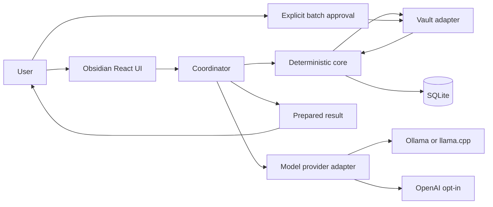
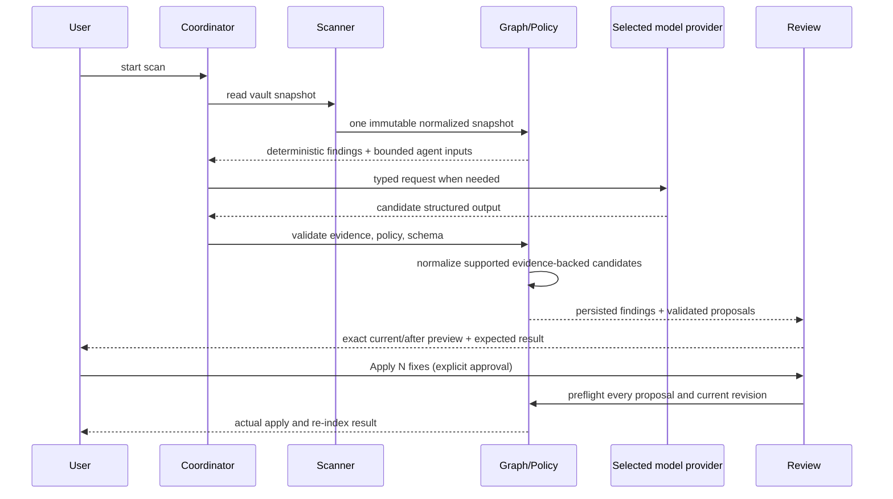

# System Architecture

## Authority

This document owns module boundaries, data ownership, trust boundaries, and workflow topology. Typed message and API shapes are authoritative in `docs/interfaces.md`.

## Deployment Model

Vault Steward is a TypeScript/React Obsidian plugin. It runs locally in the Obsidian desktop process and accesses the selected vault only through a narrow vault adapter. SQLite persists canonical indexed state. A configured model provider is required for a completed governed scan: loopback Ollama/llama.cpp by default, or the explicit fixed-origin OpenAI option after cloud-data acknowledgement.

```mermaid
flowchart LR
  U[User] --> UI[Obsidian React UI]
  UI --> C[Coordinator]
  C --> D[Deterministic core]
  D --> V[Vault adapter]
  D --> S[(SQLite)]
  C --> M[Model provider adapter]
  M --> L[Ollama or llama.cpp]
  M --> O[OpenAI opt-in]
  C --> R[Prepared result]
  R --> U
  U --> A[Explicit batch approval]
  A --> V
  V --> D
```

## Components and Ownership

| Component        | Responsibility                                                | Owns                                  |
| ---------------- | ------------------------------------------------------------- | ------------------------------------- |
| `vault-adapter`  | Narrow read/write access through Obsidian APIs                | live vault interaction                |
| `scanner`        | Parse files and generate normalized scan records              | scan snapshot inputs                  |
| `reference`      | Resolve canonical notes/anchors and explicit cleanup contexts | bounded repair candidates             |
| `core`           | Derive checks and bounded model inputs from one scan          | governed scan result                  |
| `graph`          | Build deterministic note/entity/task/reference graph          | graph projection                      |
| `policy`         | Parse and evaluate YAML policies                              | policy results                        |
| `agents`         | Produce typed candidate findings from bounded inputs          | candidate outputs only                |
| `coordinator`    | Deduplicate, prioritize, persist findings                     | recommendation ordering               |
| `findings`       | Normalize bounded deterministic/model candidates              | authoritative typed finding boundary  |
| `review`         | Prepare exact result previews and recommended actions         | approval state                        |
| `apply`          | Validate and atomically apply approved patches                | audit trail and re-index trigger      |
| `storage`        | SQLite repositories and migrations                            | persisted product state               |
| `model-provider` | Bounded structured-generation calls                           | model request/response trace metadata |

`storage` additionally owns the maintenance persistence layer introduced for
the `0.3.0` foundation: migration 12 tables for note subjects and path history,
finding identities and occurrences, review dispositions, integrity events,
retention settings, and the deletion ledger. Repositories validate persisted
contract reads and writes, keep multi-statement mutations transactional, and
run the idempotent legacy-occurrence backfill when the plugin database opens,
before scan recovery and trace pruning.

Completed-scan persistence is staged in transactions: the snapshot row and
its `scan-started` event commit first; trace, parse, finding identity/
occurrence, lineage, comparison, review-event, and `scan-completed` writes
commit together in a second transaction; any failure marks the scan `failed`
with a `scan-failed` event instead of completing it. The pure
`compareFindingOccurrences` module classifies transitions only between the
current scan and completed scans carrying an identical non-legacy
`identity_profile_hash`; legacy scans are baseline-only. Review and apply
actions append their audit events inside the same transaction as the domain
status or approval change, so event history never diverges from canonical
state.

`maintenance/changes` reads only retained completed scans sharing the latest
scan's vault fingerprint and non-legacy identity profile. It queries
comparable scan IDs without hydrating every historical scan input, then builds
a read-only Changes summary from persisted occurrence keys and revisions,
allowing the user to select an earlier compatible baseline; failed, canceled,
legacy, and incompatible scans cannot become baselines. The workspace renders
new, changed, recurring, resolved, and unchanged counts with bounded
identity-owned structural descriptors rather than rebuilding historic note
bodies or granting any write authority.

`review/dispositions` projects latest completed v2 occurrences into the
Steward Inbox, independently of finding status and pattern suppression. It
validates selected occurrence IDs and atomically appends each reviewer decision
and its metadata-only integrity event. The plugin database serializes Inbox
writes, snapshots the pre-action runtime, and restores it if disk persistence
fails; scans and active review mutations cannot overlap that rollback window.
A changed evidence revision or expired snooze returns an occurrence to due; a
restore reverses the targeted decision without rewriting history. Inbox actions
are review-only and cannot reach the vault writer or apply workflow. The Inbox keeps critical counts visible under
filters, labels supported repair-family preparation `Review fix` even when a
finding has no suggested-fix prose, and uses explicit selections for bulk
actions. Preparing a fix remains separate from explicit Apply approval.

The maintenance workspace has four keyboard-accessible destinations: Health
retains the existing scan and explicit-approval review flow, Inbox contains
revision-bound dispositions and selected-finding Ask Why/duplicate review,
Changes reads only comparable completed scans, and Timeline pages through
known integrity events via a bounded sequence cursor. It groups references
under local numbered scan/finding/occurrence/proposal/approval labels without
showing raw IDs. The Timeline never uses optional diagnostic trace spans as
history authority. Export requires an explicit click for the visible page and
strips entity IDs, note paths, excerpts, prompts, string metadata, and
unvalidated fields before handing bounded JSON to the desktop clipboard;
clipboard failures display a generic message without leaking contents.

## Main Workflow

```mermaid
sequenceDiagram
  participant User
  participant Coordinator
  participant Scanner
  participant Core as Graph/Policy
  participant Model as Selected model provider
  participant Review
  User->>Coordinator: start scan
  Coordinator->>Scanner: read vault snapshot
  Scanner->>Core: one immutable normalized snapshot
  Core-->>Coordinator: deterministic findings + bounded agent inputs
  Coordinator->>Model: typed request when needed
  Model-->>Coordinator: candidate structured output
  Coordinator->>Core: validate evidence, policy, schema
  Core->>Core: normalize supported evidence-backed candidates
  Core-->>Review: persisted findings + validated proposals
  Review-->>User: exact current/after preview + expected result
  User->>Review: Apply N fixes (explicit approval)
  Review->>Core: preflight every proposal and current revision
  Core-->>User: actual apply and re-index result
```

## State and Failure Boundaries

`ready -> scanning -> recommendation -> applying -> result`. A scan creates an
immutable snapshot ID. Findings and proposals reference that ID and the
source-file revision. The recommendation state shows either a prepared repair
batch or one judgment action. `Apply N fixes` creates individual digest-bound
approval records, then preflights the entire selected batch before any write.
A stale or invalid member aborts the batch. Runtime failures retain grouped
writes, compensating rollback, recovery-required state, and re-indexing.
Failed parser/model/policy work produces one actionable error, never a silent
mutation.

## Reference Repair Boundary

Reference resolution is deterministic and scan-scoped. It checks an exact
vault-relative Markdown path first, then a unique basename, then a unique
frontmatter alias. Multiple matches are ambiguous and cannot produce an
automatic proposal. Parsed notes expose headings and valid block IDs; fenced
and indented code and malformed block identifiers are excluded from that
metadata.

For a missing anchor on an existing note, deterministic code ranks at most 20
headings and block IDs from that note. The selected model may return one
candidate ID or abstain. It never supplies target text, patch ranges, or write
authority. Deterministic rewriting preserves wiki/Markdown link and embed
syntax, visible labels, unaffected anchors, source-relative paths, and percent
encoding.

Reference normalization is context-triggered rather than a default cleanup
scan. Only a verified rename or explicitly confirmed canonical-note decision
can authorize normalization findings. Those findings still become
revision-bound proposals and pass the normal exact-preview, approval, all-member
preflight, rollback, and re-index path.

## Structured Task And Decision Repair Boundary

Task and decision repairs use the same immutable-snapshot and approved-proposal
path as references. Models may choose a permitted intent from snapshot-derived
candidate IDs, or supply a tightly constrained cited rationale; they cannot
construct Markdown ranges, values outside the candidate list, or a write.
Deterministic checks require a task's own `completed: true` or `status: done`
metadata before changing its checkbox. Due-date candidates are limited to the
task note, its resolved project, and directly linked decisions. Decision
association repairs appear only for an explicitly broken existing project or
related-decision value, and select an existing matching note.

Each task or decision proposal remains an ordinary revision-bound
`replace-range` operation. It can join compatible reference proposals in one
batch, but all members must pass digest, revision, expected-content, and
overlap preflight before the first write. The UI displays the exact field or
task fragment before and after the change, then reports the re-indexed result.

## Duplicate-Entity Consolidation Boundary

A duplicate-entity finding opens a snapshot-bound comparison of the two cited
notes. The model may rank one of those two existing paths as the likely
canonical note or abstain; it cannot introduce a third note, create a merge,
or authorize a write. The user selects the canonical note before any proposal
is prepared.

The deterministic planner rewrites only inbound references that resolve
unambiguously to the selected duplicate. It preserves labels, anchors, embeds,
and Markdown path encoding. It can transfer only aliases that are exclusive to
the duplicate note, updating the two existing frontmatter fields together.
Neither note body is merged, deleted, or otherwise rewritten. The resulting
operations are revision-bound and flow through the normal exact-preview,
approval, all-member preflight, rollback, and re-index path.

## Scale and Bottlenecks

The first release targets one desktop vault and batch scans. Expected bottlenecks are Markdown parsing, SQLite writes, and model inference. The adapter normalizes vault events into a bounded plan and conservatively falls back to a full governed scan for create, rename, delete, invalid, or overflowed batches. Within a running plugin process, immutable parsed notes are reused only when normalized path, revision, and bound subject are exact; SQLite stores eligibility metadata and dependency edges without retaining note bodies.

Note subjects are opaque UUIDs persisted in `note_subjects`/`note_path_history`; identity never derives from paths or content. Vault create/modify/delete/rename events mutate bindings through `PluginDatabase.processVaultEvents`, which flushes mutations to the database file before the scan consumes the batch: a create binds a fresh UUID, a modify retains the binding, a delete retires it without reuse, and a rename preserves the subject only when the old path resolves to exactly one active subject and the normalized new path is safe and unused — every other rename shape is unverified: conflicting safe bindings are retired immediately and current paths are rebound to fresh subjects during synchronization, so ambiguous renames always fork identity. `synchronizeNoteSubjects` reconciles the listed vault paths each scan, retiring absent bindings and binding unbound paths, so unobserved or offline renames always receive new subjects. File revisions hash content only, so a path-only rename keeps the evidence revision key and does not wake a snooze. A bounded in-memory coordinator cache reuses a model route only when its provider identity and declared route context are exact; changing one route's evidence invalidates that route without authorizing reuse of another. Model concurrency remains capped at one and per-agent context is bounded before considering background workers or a vector store.

Optional retrieval remains a derived local optimization. Evaluation can consume redacted ranked-candidate metadata to measure coverage, relevance, cache behavior, score distributions, and latency, but no retrieval result is an authority source for a finding, policy decision, proposal, approval, or edit.
