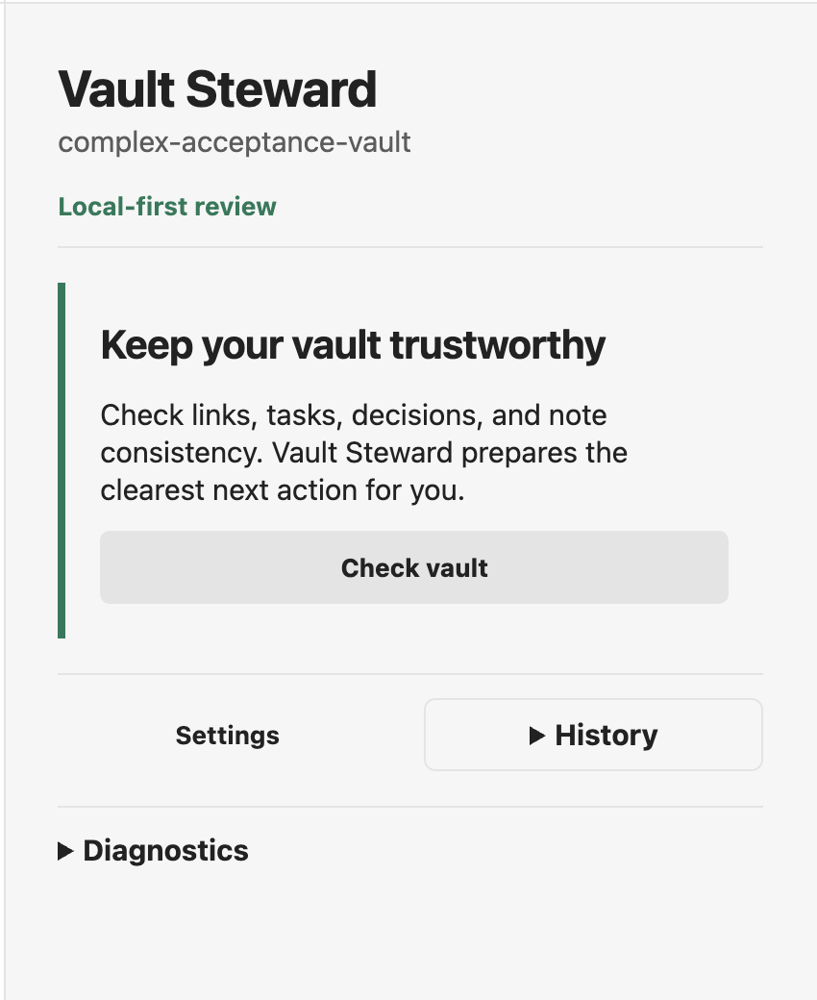
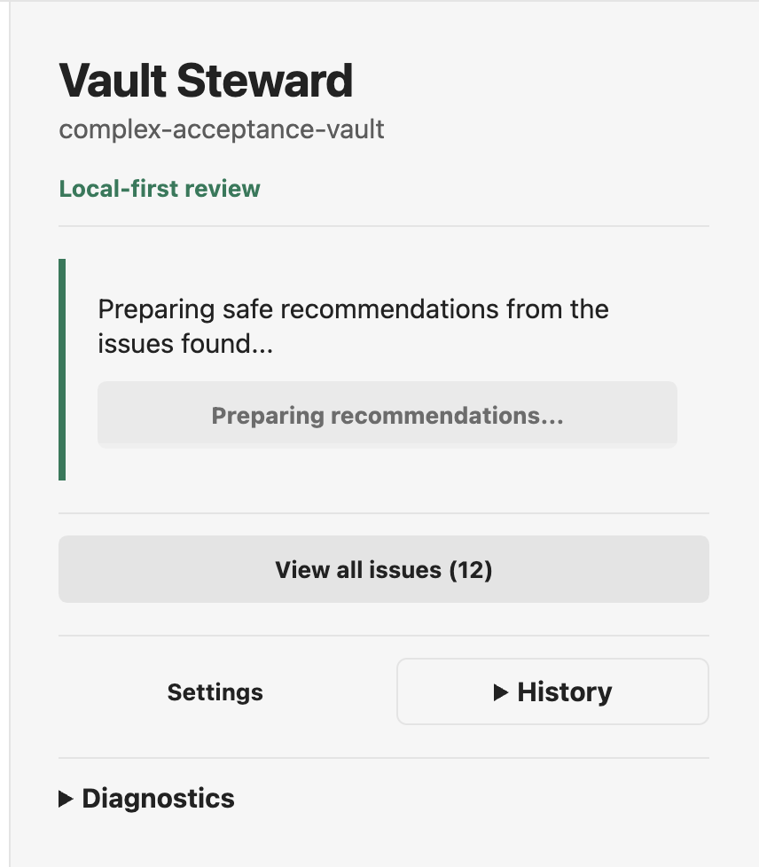
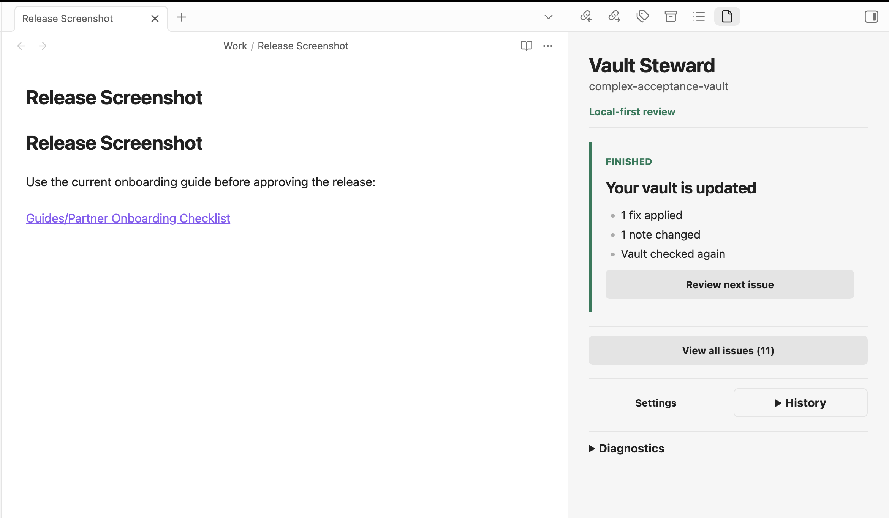

# Vault Steward Walkthrough

These screenshots show the current macOS desktop flow. Vault Steward scans the
vault, prepares a bounded recommendation, shows the exact proposed change, and
edits the note only after explicit approval.

## 1. Start a vault check

Choose **Check vault** when you are ready to review the current vault.

## 2. Prepare recommendations

Deterministic checks run first. When applicable, the configured model reviews
only bounded evidence and prepares safe recommendations.

## 3. Review and approve the exact change

The approval screen shows **Current** and **After** text, the affected note,
and the expected result. Nothing changes until **Apply** is selected.

## 4. Confirm the result

After applying the selected fix, Vault Steward reports how many fixes and
notes changed and checks the vault again.

