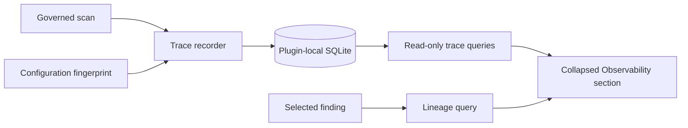

# Phase 13: Local Trace Inspector and Agent Observability Design

## Status

Approved design. This document defines Phase 13 only; it does not authorize
implementation of later replay, evaluation, model-comparison, or synthetic-vault
work.

## Problem

Phase 12 persistently records metadata-only scan spans, local model executions,
and finding lineage. The information is useful for debugging, trust, and quality
work, but it is not yet inspectable in the Obsidian workspace. Users therefore
cannot answer basic questions such as which stage failed, which local model route
contributed to a finding, or which non-content configuration produced a scan.

The design must improve inspectability without turning the everyday review
workspace into a diagnostics console or storing vault contents as telemetry.

## Goals

- Show an inspectable, metadata-only timeline for a completed or incomplete scan.
- Show a finding's deterministic lineage from vault-relative evidence locator to
  coordinator decision, without rendering stored note excerpts.
- Make model, prompt, schema, policy, and retrieval configuration comparable with
  stable configuration fingerprints.
- Give users local-only, explicit controls over optional redacted snapshots,
  exclusions, retention, and deletion.
- Summarize operational health with content-free metrics that make incomplete
  work, failures, and regressions visible.

## Non-Goals

- Replaying scans, comparing models, or evaluating model quality. Those belong to
  Phases 14 and 15.
- Reconstructing an old vault snapshot. The database does not retain note bodies.
- Uploading traces, remote analytics, background accounts, or cloud storage.
- Letting an agent read, write, delete, or modify telemetry settings.
- Expanding automatic repairs beyond the existing deterministic proposal rules.

## Chosen Product Shape

The workspace receives a single collapsed **Observability** section below scan
history. Opening it selects a scan and exposes three compact, read-only panels:

1. **Timeline**: pipeline spans, ordered by start time.
2. **Finding lineage**: a selected finding's evidence and decision chain.
3. **Configuration and metrics**: immutable fingerprint inputs, data inventory,
   and aggregate operational measurements.

This is preferred over a new top-level workspace because the existing dashboard
already prioritizes review actions. It is also preferred over embedding
diagnostics in every finding detail because that made the previous detail surface
visually congested. The main finding detail remains concise and links to the
selected finding's lineage only when the user opens Observability.

## Architecture

The trace recorder remains part of the plugin/core boundary, not a second logging
system. Each stage emits a typed, bounded record through the existing repository.
The React workspace consumes query results through the plugin facade. Core modules
continue to have no Obsidian dependency.

## Trace and Lineage Model

### Spans

Phase 13 adds one root span and bounded child spans for these kinds:

- `scanner`
- `indexing`
- `retrieval`
- `agent`
- `validation`
- `policy`
- `coordinator`
- `finding`

A span stores its IDs, parent relationship, start/end timestamps, outcome,
correlation ID, and a whitelist of metadata values. The whitelist includes counts,
durations, retry count, cache-hit boolean, and redacted error code. It excludes
note text, prompts, model output, absolute paths, URLs, secrets, and free-form
error stacks.

Child spans may be absent when a stage was not eligible for a scan. The UI renders
them as `not run`, rather than treating absence as success. Incomplete scans keep
their completed spans and display the terminal failure safely.

### Finding lineage

Each lineage record is presented as a linear, evidence-first chain:

`evidence locator -> parsed artifact ID -> retrieval metadata -> agent execution
-> validator -> policy evaluation -> coordinator decision -> proposal source`

Every hop has a stable ID and a status. Retrieval metadata is limited to document
or artifact ID, rank, score bucket, and count; it never includes a retrieved note
excerpt. A missing required hop is an integrity error: the finding is hidden from
the review queue as Phase 12 already requires, and the inspector records a
metadata-only diagnostic.

Evidence locators stay vault-relative. They can open a live note only through an
explicit user click in the active Obsidian workspace. Historical lineage never
copies note content into SQLite or the inspector.

## Configuration Fingerprint

A pure configuration-fingerprint module receives a canonical object and returns a
stable SHA-256 digest. It includes only version identifiers and bounded settings:

- plugin, parser, agent, input-schema, and output-schema versions;
- prompt bundle IDs and versions, never prompt text;
- local provider/model profile and declared generation parameters;
- policy ID/version and retrieval/chunking/top-k/threshold settings; and
- model-route and embedding configuration identifiers where applicable.

Objects are recursively key-sorted before serialization. Invalid, unbounded, or
content-bearing values are rejected. A new fingerprint is recorded for every scan;
equal canonical inputs yield the same fingerprint, while any included input change
yields a different one. The UI shows a labeled list of the included values and a
short fingerprint, with a copy control for the full value.

## Privacy and Retention

Metadata-only tracing remains always-on because it is required to explain scan
status and finding provenance. Prompt snapshots and structured model-output
snapshots are optional, disabled by default, and never necessary for a governed
scan to complete.

When enabled, optional snapshots must first pass a redaction pipeline that removes
absolute paths, URLs, known secret patterns, and vault excerpts. Per-record and
total-store size caps apply before persistence. A rejected snapshot creates only a
safe rejection count and error code.

The settings surface provides:

- retention days, with a bounded allowed range;
- opt-in toggles for redacted prompt and structured-output snapshots;
- vault-relative folder exclusions, validated for traversal and stored without
  contents;
- an excerpt-redaction toggle, enabled by default and immutable while any optional
  snapshot capture is enabled;
- per-scan trace deletion and delete-all telemetry; and
- a stored-data inventory by retained category, count, approximate size, and
  oldest/newest timestamp.

Deleting traces must preserve approvals and application audit records. Every
deletion is locally auditable by category and timestamp without retaining deleted
data.

## Operational Metrics

The metrics panel aggregates content-free records per selected scan and across a
bounded recent history. It exposes:

- total scan and per-stage/agent duration, p50, and p95 latency;
- parse, index, retrieval, validation, and model failure counts;
- model load time, token estimates, retry count, and incomplete-scan rate;
- parse and route-cache hit rate;
- review-queue depth, stale proposals, apply failures, and scan finding count;
- SQLite database size and retained trace inventory.

Metrics with insufficient samples display `not enough data`; no invented percentile
is shown. The repository returns typed aggregates only, never rows containing note
content. Phase 13 establishes measurements and baseline fixtures; performance
regression thresholds remain Phase 14 work.

## UI Behavior

- Observability is closed by default and keyboard accessible.
- Selecting a scan never reruns it or changes its result.
- The timeline uses fixed columns for stage, outcome, duration, retries, and
  counts. On narrow panes it becomes a vertically stacked list with the same
  labels.
- Selecting a finding highlights its lineage; selecting no finding leaves the
  scan-level timeline and configuration visible.
- The normal Review/repair controls do not move or gain diagnostic fields.
- Local errors use a generic message plus a redacted code and correlation ID.

## Failure Handling

- If observability storage is unavailable, the scan remains governed but reports a
  visible `trace-storage-unavailable` warning and does not fabricate a timeline.
- Invalid metadata, lineage, fingerprint inputs, excluded folders, or optional
  snapshot content is rejected before persistence.
- Query failures show an empty-state diagnostic without hiding the normal finding
  queue.
- Retention cleanup failure is retried on the next plugin start or completed scan;
  it never deletes approvals or audit records.

## Implementation Boundaries

- Add new types under `src/contracts/` and runtime validators at every storage/UI
  boundary.
- Extend the existing SQLite migration/repository path. Do not introduce a new
  database or external dependency.
- Keep span emission behind a core-compatible recorder interface; plugin wiring
  supplies persistence.
- Keep fingerprinting pure and deterministic, with no provider call or vault read.
- Add UI models/adapters rather than making React query SQLite directly.

## Test Strategy and Acceptance Criteria

Deterministic tests must cover:

1. Valid span hierarchy, allowed metadata, missing-stage display, and invalid
   metadata rejection.
2. Lineage ordering, missing-hop rejection, active-view-only live-evidence action,
   and absence of persisted note excerpts.
3. Canonical configuration hashing: key-order invariance, equality for equal
   configurations, and a changed fingerprint for every included input mutation.
4. Opt-in defaults, redaction/cap rejection, folder traversal rejection, retention
   cleanup, per-scan/delete-all semantics, and audit-record preservation.
5. Aggregate metric calculations, percentile behavior with insufficient samples,
   and content-free repository query results.
6. UI keyboard behavior, collapsed initial state, narrow-pane layout, and a scan
   whose trace query fails while normal findings remain usable.

Phase completion requires the relevant unit, integration, UI/E2E, typecheck,
build, evaluation smoke, and security checks described in `AGENTS.md`. No trace
fixture may contain a vault body, prompt text, model-output body, secret, absolute
vault path, or network endpoint.

## Deferred Decisions

Exact replay, baseline comparison, model comparison, fixture evaluation, and
confidence calibration rely on this trace/fingerprint foundation and remain
explicitly deferred to Phases 14 through 16.
