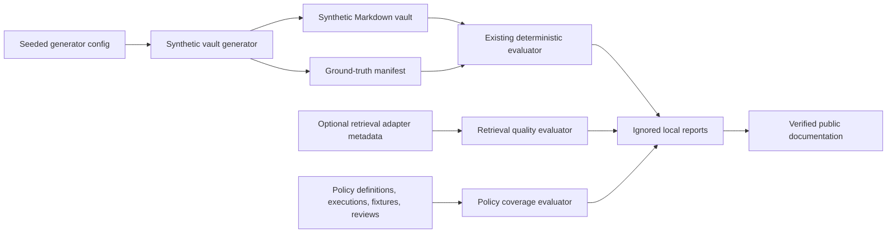

# Phase 16: Advanced Quality Coverage and Public Documentation Design

## Status

Approved design for implementation planning. This document scopes Phase 16 only; it does not add a retrieval engine, change scan authority, or publish unverified claims.

## Problem

Vault Steward has deterministic fixture evaluations, metadata-only tracing, replay, controlled comparisons, and local quality reports. It lacks three things needed to improve those controls safely:

1. A repeatable way to generate larger, defect-labelled vaults for scale and recall evaluation.
2. A common, optional interface for measuring local retrieval quality without granting retrieval authority.
3. A policy-coverage report that reveals rules lacking execution, fixtures, or useful quality feedback.

The existing README is accurate but organized primarily around implementation capabilities. Public users and contributors need concise, linked documentation that explains the product, trust model, setup, evidence workflow, measured limits, quality process, and release expectations.

## Goals

- Generate seeded synthetic vaults with bounded topology and exact injected-defect ground truth.
- Evaluate optional retrieval adapters using metadata-only coverage, score-distribution, cache-hit, and evidence-relevance measurements.
- Report local policy coverage and reviewer-feedback signals without changing policy or finding authority.
- Rewrite the README and add focused linked documents that make only claims supported by code, tests, or an explicitly dated manual protocol.
- Preserve offline operation and keep SQLite the canonical product store.

## Non-Goals

- Add a vector database, embedding provider, cloud service, remote telemetry, or automatic model selection.
- Make retrieval, synthetic-eval output, policy coverage, confidence, or reviewer feedback authorize findings, policy updates, severities, proposals, approvals, or vault edits.
- Include vault note bodies, excerpts, prompts, raw model output, URLs, absolute paths, secrets, or personal reviewer labels in generated reports.
- Build an Obsidian dashboard for every new report in this phase. Local CLI reports and focused documentation are sufficient.
- Claim model accuracy, compatibility, hardware support, or marketplace availability without a corresponding reproducible measurement or release record.

## Assumptions

- `evals/` remains a TypeScript-first, local-only evaluation workspace; reports remain ignored by Git.
- Existing fixture loading and deterministic graders are the integration point for synthetic generated vaults.
- Retrieval remains absent by default. A `not-configured` result is valid and is not a failure of scanning.
- Existing persisted policy evaluation and reviewer feedback records provide inputs for coverage aggregation. Where a record cannot prove a dimension, the report states `unknown` or `0` rather than inferring it.
- Documentation can be updated in one final task after implementation results and manual acceptance records are available.

## Architecture



All three evaluators are pure TypeScript functions under `evals/` or a similarly bounded core-independent module. They consume structured inputs and emit redacted report objects. Thin scripts handle local file loading and report writing. No evaluator imports Obsidian APIs, writes a vault, or calls a model provider.

## 1. Seeded Synthetic Vault Generator

### Configuration

`SyntheticVaultConfig` must contain only bounded, deterministic values:

```ts
type SyntheticVaultConfig = {
  seed: string;
  noteCount: number;
  folderDepth: number;
  linkDensity: number;
  entityCount: number;
  taskCount: number;
  decisionCount: number;
  contradictionRate: number;
  duplicateEntityRate: number;
  brokenReferenceRate: number;
  stalenessRate: number;
  orphanTaskRate: number;
  schemaViolationRate: number;
  unresolvedDecisionRate: number;
};
```

All counts have documented upper bounds. Rates are finite values in `[0, 1]`. Invalid configuration fails before any files are written. The seeded pseudo-random generator must be implemented locally and must not use time, hardware state, or global `Math.random`.

### Output

The generator produces a disposable evaluation root containing:

```text
vault/                 generated Markdown notes
ground-truth.json      stable identifiers, defect kind, expected locator, severity
metadata.json          seed, normalized configuration, generator schema version, counts
```

Ground truth identifies defects by stable generated identifiers and relative locators only. It contains neither arbitrary note bodies nor user-vault material. Repeating the same normalized configuration yields byte-equivalent output ordering and the same ground-truth manifest hash.

### Defect Injection

Injection occurs after a valid base topology is generated. Each injector owns one defect family and records a ground-truth entry only when it successfully changes a generated note:

- contradictions;
- duplicate entities;
- broken internal references;
- stale notes;
- orphaned tasks;
- schema violations; and
- unresolved decisions.

The generator caps injection attempts and records achieved rather than requested counts to avoid false ground truth at very small scales. It supports no arbitrary user templates in this phase.

### Scale and Recall Use

The evaluation runner loads generated ground truth through a fixture-compatible adapter. Scale scenarios use named configurations committed as small JSON files. Generated vault directories and reports remain ignored. The runner reports precision, recall, F1, generation duration, generated file count, and defect counts; it never turns generated findings into product findings.

## 2. Optional Retrieval-Quality Evaluation

### Contract

Retrieval is an optional derived capability. A local adapter exposes safe identifiers and ranked candidate metadata:

```ts
type RetrievalEvent = {
  queryId: string;
  requestedK: number;
  candidates: Array<{ evidenceId: string; score: number }>;
  cache: "hit" | "miss" | "not-applicable";
  durationMs: number;
};

type RetrievalExpectation = {
  queryId: string;
  relevantEvidenceIds: string[];
};
```

`evaluateRetrievalQuality(events, expectations)` returns coverage/recall-at-k, score distribution summaries, cache-hit rate, relevant-evidence rate, missing-query count, and p50/p95 latency. It rejects invalid IDs, non-finite scores, duplicate query IDs, unsafe metadata, and inconsistent expected evidence before calculating metrics.

### Authority Boundary

The report is evaluative only. SQLite remains canonical. A retrieval event cannot prove a finding, fill missing evidence, authorize a route, change a policy, or produce an edit. If no adapter is configured, the report contains a redacted `not-configured` status and no quality numbers.

### Observability

The existing trace/repository metrics can retain aggregate retrieval counters only. This phase may map the evaluator's safe aggregates into an operational report, but it must not persist raw similarity queries, note chunks, vectors, prompts, or model output.

## 3. Policy Coverage

### Inputs and Metrics

`summarizePolicyCoverage` consumes normalized policy definitions, deterministic policy execution records, fixture metadata, and redacted reviewer verdict aggregates. It reports one stable row per policy version:

| Metric                    | Meaning                                                                       |
| ------------------------- | ----------------------------------------------------------------------------- |
| defined                   | policy is present and valid                                                   |
| executed                  | evaluation ran at least once                                                  |
| triggered                 | evaluation produced at least one violation                                    |
| fixtureCoverage           | at least one fixture explicitly names the policy                              |
| reviewerFalsePositiveRate | aggregate false-positive verdicts when available                              |
| deprecated                | definition is marked deprecated                                               |
| status                    | `covered`, `unexercised`, `missing-fixture`, `review-needed`, or `deprecated` |

Missing reviewer data is `null`, not `0`. A deterministic status precedence is documented and tested: deprecated first, then unexercised, missing fixture, review-needed, and covered. Reports make suggestions such as “add a fixture” only; they cannot write YAML or modify policies.

### Privacy

Reviewer identity and free-form feedback are excluded. The report stores stable policy IDs/versions and aggregate counts only.

## 4. Documentation

### README

The README becomes a concise entry point with these verified sections:

1. Product positioning and audience.
2. Problem and evidence-backed review workflow.
3. Local-first trust model and explicit no-automatic-edit boundary.
4. Architecture and why bounded local agents exist.
5. Manual installation, local model setup, and tested-model guidance.
6. Evaluation, observability, and reproducible quality reports.
7. Limitations, development commands, and contribution entry points.

It never mentions implementation phases or reports marketplace availability unless released there.

### Linked Documents

Add or refresh the following focused files, each linked from the README:

```text
EVALS.md           methodology, fixtures, baselines, replay, synthetic generation
OBSERVABILITY.md    local storage, trace/report contents, retention and deletion
PRIVACY.md          data access, local-only guarantees, stored-data boundaries
SECURITY.md         reporting route, threat model, file/model/dependency protections
CONTRIBUTING.md     prerequisites, quality gates, fixture/prompt/policy change rules
ROADMAP.md          concrete future milestones only
CHANGELOG.md        versioned release history beginning with the current pre-release
docs/local-models.md         tested local model guidance and resource caveats
docs/troubleshooting.md      setup, provider, database, report, and package recovery
docs/release-compatibility.md supported Obsidian/package compatibility and checks
```

Existing architecture, runbooks, upgrade notes, and desktop accessibility protocol remain canonical for their focused topics and are linked instead of duplicated.

### Claim Verification

Every public claim must point to one of: a passing automated test, a committed baseline/report schema, an existing release manifest, or a dated manual protocol. The documentation task adds a lightweight link/claim check that rejects stale phase language, remote-telemetry claims, undocumented commands, and unavailable marketplace claims.

## Testing and Acceptance Criteria

### Generator

- Same seed/configuration produces identical relative files and ground truth.
- Different seed changes at least the deterministic identifier set without unsafe paths.
- Invalid/oversized values fail closed.
- Achieved defect counts and locators match generated files.
- A generated scale scenario runs through the evaluator and reports ground-truth metrics.

### Retrieval

- Correct coverage, relevance, score summary, cache-hit, and percentile calculations.
- Empty/not-configured adapters produce explicit safe reports.
- Invalid metadata is rejected; no report serializes unsafe content.
- No retrieval report or adapter can reach finding, proposal, approval, apply, or policy-write modules.

### Policy Coverage

- Stable grouping and status precedence across valid/invalid/deprecated definitions.
- Missing fixtures, never-executed policies, feedback absence, and repeated false positives are distinct.
- Aggregate-only reviewer data is verified by contract tests.
- No suggestion mutates policy storage.

### Documentation

- README headings/links and all named linked documents exist.
- Command examples map to package scripts or documented manual protocols.
- A static check rejects phase-progress prose, remote telemetry claims, false marketplace installation claims, and unlinked required documents.
- Manual documentation acceptance records the Obsidian and local-model setup state separately from automated claims.

### Completion Gate

Run focused generator/retrieval/policy/docs tests, then the repository formatting, lint, typecheck, build, package/install, unit, integration, end-to-end, acceptance, smoke/full evaluation, fixture regression, performance, operations, and production dependency security checks. Generate the required Phase 16 interactive diff explanation after verified code and documentation are complete, then merge and push `development`.

## Risks and Mitigations

| Risk                                          | Mitigation                                                                                                      |
| --------------------------------------------- | --------------------------------------------------------------------------------------------------------------- |
| Synthetic data creates unrealistic confidence | Keep explicit generated topology/defect configurations, do not market synthetic metrics as user-vault accuracy. |
| Retrieval metrics imply authority             | Keep the adapter optional, use evaluative contracts only, and add import/boundary tests.                        |
| Policy coverage causes automatic tuning       | Produce aggregate suggestions only; preserve explicit Policy Studio save workflow.                              |
| Documentation drifts                          | Test claims and command links; update docs in the final verified task.                                          |
| Reports expose vault data                     | Validate bounded identifiers and aggregate numbers; keep generated/report artifacts ignored.                    |

## Scope Decision

The phase uses the evaluation-first, adapter-neutral approach. Implementation order is synthetic ground truth, retrieval metrics, policy coverage, then verified documentation. SQLite remains canonical, and none of the new reports alters product authority.
